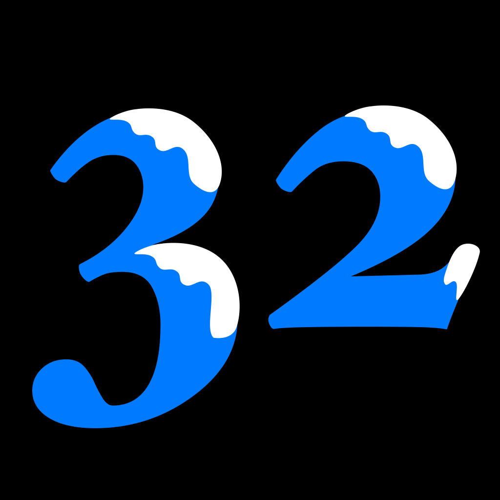

# Frozone
> Coolest devs in town since '21

## Project Domain
Task manager bullet journal.

## Learn about our project

| Pages | Description |
|---| ---|
|[Published Version](https://cse110-sp21-group32.github.io/cse110-sp21-group32/)| Find our published website running the latest build here
| [Sizzle Reel]() | Find our demo of how the latest version works here!|
| [Meet the team](./admin/team.md)| Learn about the founding dev team of this project here!
| [Pitch Document](specs/pitch/Starting%20Pitch.pdf) | Learn about our vision and expected challenges here!

## Learn about contributing
| Pages | Description |
|---| ---|
| [Onboarding Document](./admin/onboarding.md) | Find the detailed specs of what you need to know before you can contribute
| [Onboarding Video]() | Get a quick introduction on how to get involved before you contribute
| [Team Contract](./admin/misc/rules.md) | Read the rules that our team abided by
| [Testing]((test/testing.md))| Getting started with automated, unit, and end-2-end testing
| [Slack](https://cse110-sp21-group32.slack.com/)| Get in contact with us on Slack 
| [JSDoc Function Documentation](specs/documentation/index.html) | Learn about the functions we use here
| [Style Guide](admin/style-guide.md) | Learn about how we style our code to stay consistent with existing code base

## Learn about what we've done
|Pages | Description|
| ---| ---|
| [Pipeline Phase 2](admin/cipipeline/phas2.md) | Find our how our automated linting, building, and testing pipeline works |
| [Meeting Notes](admin/meetings/) | See our regular meeting and standup notes here
| [ADR](specs/adrs/) | See all of the big decisions we made here 
| [Pipeline](admin/cipipeline/) | See our pipeline updates here

## TESTING DISCLAIMER

The newest version was pushed late June 10, 2021, the day of the due date. 
The testing team strive to edit all the related tests to make most of the tests working for our latest version.

More information on the testing coverage can be found in the [Testing]((test/testing.md)) document.

Also the test, inclucing unit/e2e testings, are functional and working locally following the procedure in [Testing]((test/testing.md)) document. However these tesstings are not working in the github actions and we took the suggestions from TA that it is ok.

### Known working versions/systems

- Firefox 89.0 on Ubuntu
- Chrome Version 90.0.4430.93 (Official Build) (x86_64) on MacOs
- Chrome on Windows

### Known not working version/systems
- Chromium Version 91.0.4472.77 (Official Build) (64-bit) on Ubuntu
- Firefox on MacOs 