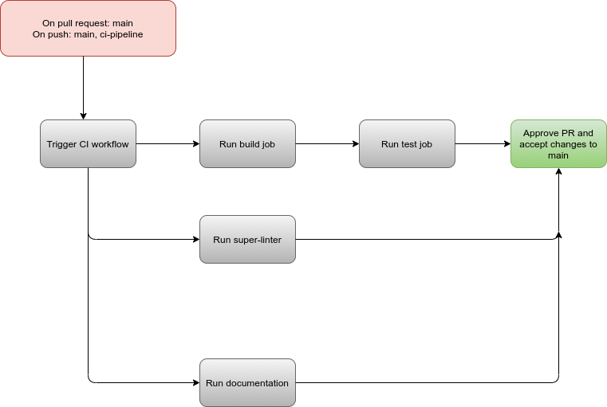

# Status on the pipeline
## What is currently functional?
Currently, we have successfully implemented the base functionalities of our CI/CD pipeline. This is where we are in terms of completion:

- [x] Linting and code style enforcement (may happen in pipeline and/or in editor)
- [x] Code quality via tool  (ex. Codeclimate, Codacy, etc.)
- [X] Code quality via human review (ex. Pull Requests)
- [X] We plan to make our pipeline more robust by adding Unit Tests 
- [X] We need to integrate our code quality tool Codacy with our Github workflow.
- [ ] Unit tests via automation (ex. Jest, Tape, Ava, Cypress, Mocha/Chai, etc.)*
- [X] Documentation generation via automation (ex. JSDocs)

## Phase 2 Highlights

* Implemented linting for CSS, HMTL
* Implemented linting for specific directory source
* Wrote basic unit tests

All the tests were written in the "Unit Test" branch until the rest of the integration is ready and are stored in a top level directory `__tests__`

## What's happening

Our workflow has 4 jobs: build, test, styling, and documentation. As of right now, the build job does a simple npm install and npm build:
```bash
npm install
npm run build --if-present
```

The test job is set as dependable on build job and therefore waits for this one to complete before executing the following commands:
```bash
npm install
npm install --save-dev jest
npm install --save execa
npm install --save-dev jest babel-jest @babel/core @babel/preset-env
npm run test
```

The Lint Code Base job is set to run in parallel. This one is a github repo called [Super Linter](https://github.com/github/super-linter)that is able to run a linter on every programmming language available in our repo. 

Our initial diagram looked like this:


Our updated pipeline looks like this:


Additionally, we chose to setup our repo with a code quality tool, [Codacy](https://app.codacy.com/organizations/gh/cse110-sp21-group32/repositories).

## What is planned/in progress?

- There's some confusion regarding how to run pipeline on specific branches. Our final sprint will address this issue and finalize the repo's workflow
- We still have some points to discuss with our stakeholders about pipeline design 
