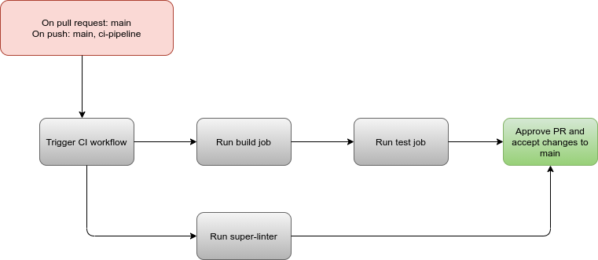
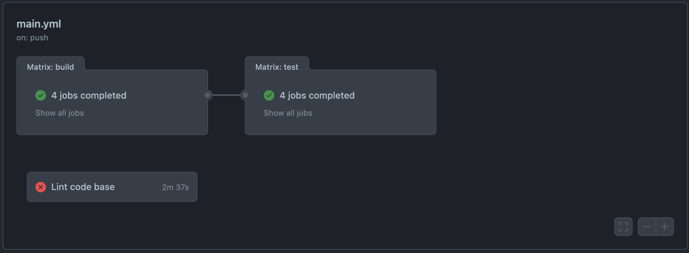

# Status on the pipeline
## What is currently functional?
Currently, we have successfully implemented the base functionalities of our CI/CD pipeline. This is where we are in terms of completion:

- [x] Linting and code style enforcement (may happen in pipeline and/or in editor)
- [x] Code quality via tool  (ex. Codeclimate, Codacy, etc.)
- [X] Code quality via human review (ex. Pull Requests)
- [ ] Unit tests via automation (ex. Jest, Tape, Ava, Cypress, Mocha/Chai, etc.)*
- [ ] Documentation generation via automation (ex. JSDocs)

Our workflow has 3 jobs: build, test, and Lint Code Base. As of right now, the build job does a simple npm install and npm build:
```
npm install
npm run build --if-present
```

The test job is set as dependable on build job and therefore waits for this one to complete before executing the following commands:
```
npm install
npm test
```

The Lint Code Base job is set to run in parallel. This one is a github repo called [Super Linter](https://github.com/github/super-linter)that is able to run a linter on every programmming language available in our repo. 

Our current diagram looks like this:




Additionally, we chose to setup our repo with a code quality tool, [Codacy](https://app.codacy.com/organizations/gh/cse110-sp21-group32/repositories).

## What is planned/in progress?
1. Improve Unit Tests and Automatic Documentation Generation. 
2. Improve codecy
3. To discuss with our stakeholders about pipeline design 
