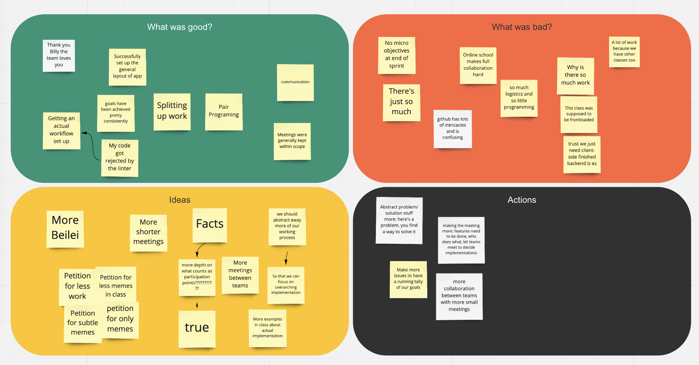

# 5/15 Retrospective Meeting

### Highlights
* Pair programming set up
* Communication is smooth in slack and zoom (psychological safety)
* Logics of splitting the tasks is fair (almost even distribution)
* Meetings stayed focused and within the scope
* Groups goals are achieved in time
* The github logistics (style guide and CICD) setted up 

### Challenges
* There are many small tasks every week. It is hard to avoid missing some of them
* Missing specific tasks within the group
* Logistics took lots of time. Time left for programming is limited
* Backend ideas/solutions are still not finlaized

### Actions (Should do in the Future)
* Making more issues in github to clearify the goals
* Meeings logistics could be improved
    * Instead only having big meetings with everyone two times per week we can increase the frequency of smaller meetings within the task groups or among two task groups

### Screenshots in Miro
