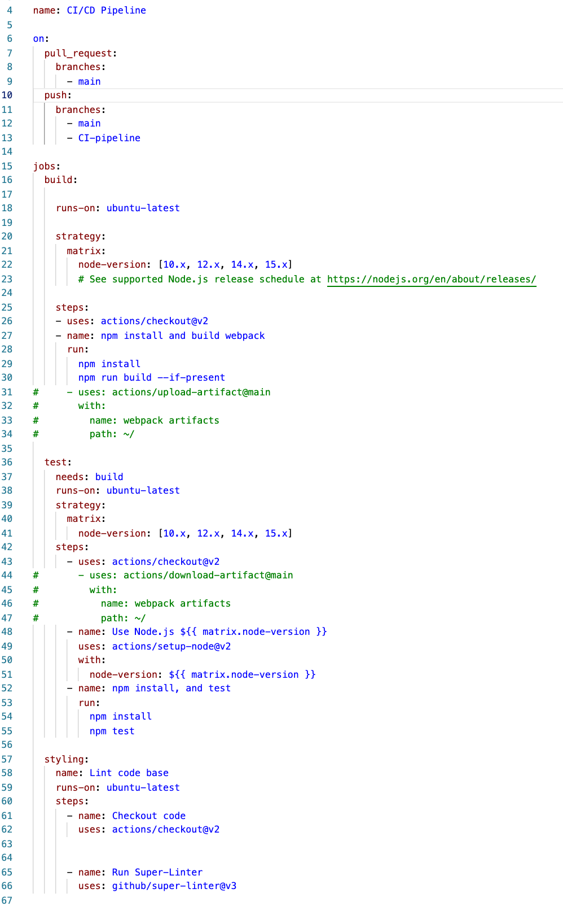
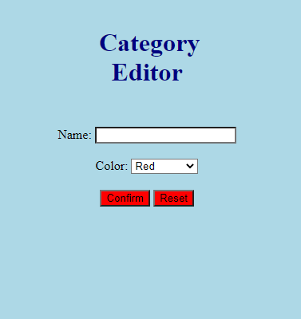
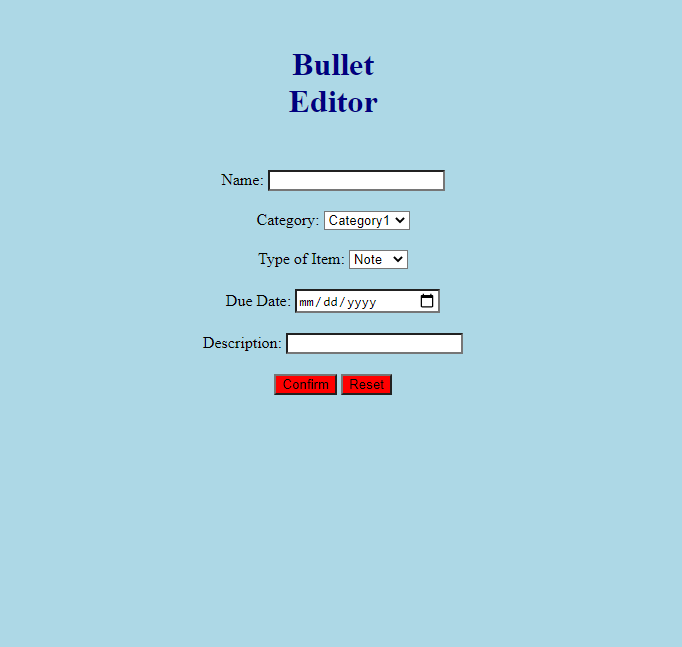

# 5/12 Sprint 1 Review Meeting

### Team Tasks Updates:

##### Sanjai, Ryan, Andres
What's Done:
Established style guides for Github, JavaScript, and HTML/CSS
Created Github Templates for Bug Reports and Feature Requests
Created a template to document team updates on Github
CI-CD Workflows

What will be worked on:
Schedule OH specifically to set up workflows
Integrating testing with workflows

# Beilei, Tony, Rudy, Aman
*Submit by 10pm Monday Night*

What's Done:
Set up a general structure of the main page

What will be worked on:
Implement logistics and functionality of the app

# Yotam, Richard
*Submit by 10pm Monday Night*

What's Done:
Set up a general structure of the Bullet Editor and Category Editor

What will be worked on:
Integrate with main page of the journal main page

Other notes:
The category items are the place holders for users custom categories
The files are in editors-layout branch

