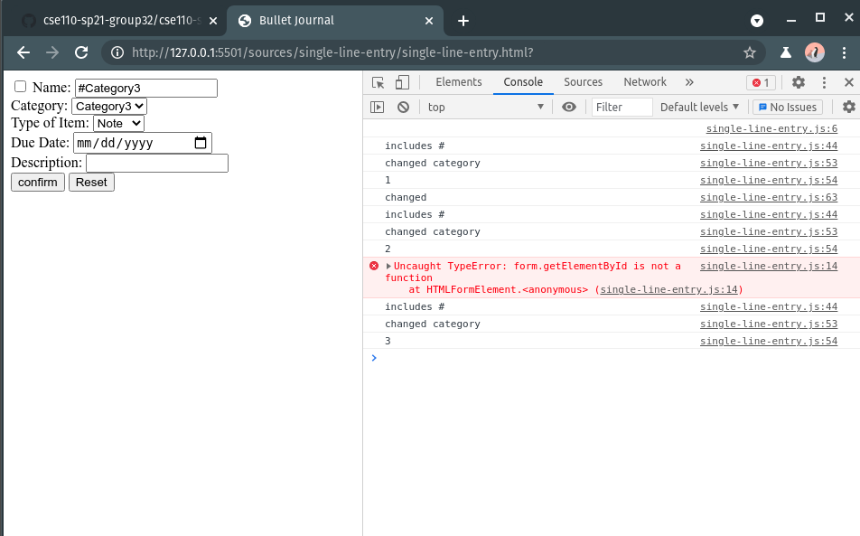
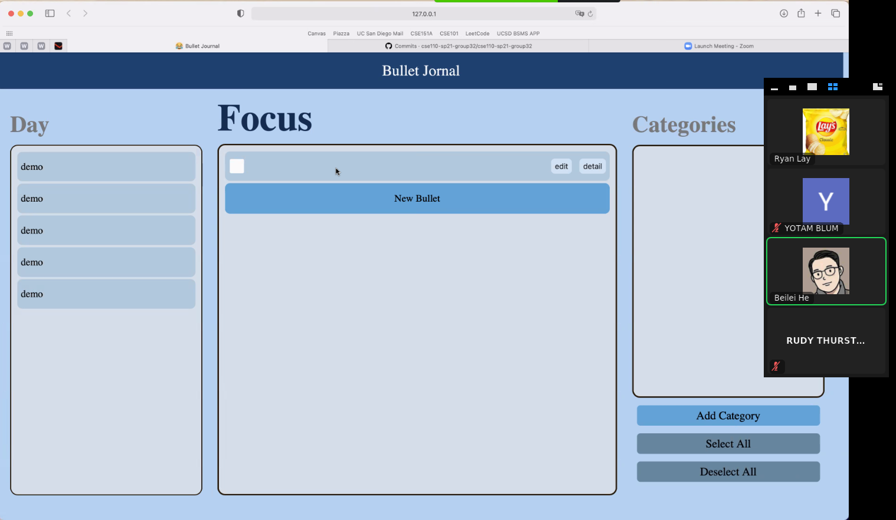

# 5/13 Planning Meeting

Team 32 Frozone

@[zoom](https://ucsd.zoom.us/j/96599645461r), Started at 4:00pm ended around 7:39pm

## Agenda: (~1hr)
Agenda:
- Going over the design of overall web page
- Logistics overview

## Notes

- Notes on inline bullet entry
  [https://stackoverflow.com/questions/7373058/changing-the-selected-option-of-an-html-select-element](https://stackoverflow.com/questions/7373058/changing-the-selected-option-of-an-html-select-element)

  [https://www.w3schools.com/js/js_string_methods.asp](https://www.w3schools.com/js/js_string_methods.asp)

### What we've got so far

### Ideas

- changes
  - remove due date
  - change way tasks are completed
  - change side panel to day view
  - move the "add bullet" location
  - clicking off of bullet auto saves changes
- focus section
  - only focuses on the selected day's things
- due date:
  - notes and events it doesn't make sense to have due date
  - we don't have notification feature so why have due dates?
    - remove the due dates
    - what do we show on the left side then?
    - how do we complete the thing for the day then?
  - comment
    - make it so that the due date gets hidden if it's a note or a task
    - if have more time, add some sort of notification feature
    - add the due date to the details panel?
- Day selector
  - picking a different day will bring up all the things for that day
  - add signifier to how much content is in each day
  - only previous days
  - default day will be based on system date
- finishing tasks
  - (prev) disappear and have a separate view for that
  - more efficient for the color of task to be grayed out without disappearing
  - allows us to apply this to other types of bullets
- defaults
  - task or note should be default
- categories
  - still functions as filter
  - view by category instead of just by day
  - contains all the previous tasks as well
- User-idea
  - more flexibilty
    - a new blank bullet gets added and fill in details as wanted
    - most of the things are optional
  - find more things that the user would want
    - reduce amount of clicks
    - have default values
  - point of inline bullet entry
    - not to save strokes, to give user option of choosing what information they want
    - currently all fields are optional
  - no submit button, just a "change" event
  - what would a user want to put down?
    - regards to event and notes
    - more like a journal
- for large systems
  - looking for specific note?
- Search?
- problem: how to find note where reminder was made
  - reminder date: automatically show up on that focus day
  - or paradigm the user only puts things they'll "do"

### What will the user's be looking at our thing for focus on?

- ex: re-occurring like to-doist
- ex: lots of ideas like google keep
- we want focus, we want categories
- what else do we want?

1. keep it organied
   1. by category just focus on differentiating between "modes"
      1. ex: snowboarding, etc.
   2. easy to compartmentalize them
2. day to day thing
   1. similar to daily journal

- focus is more of a reference page
  - like flipping through the book
  - sorted by date
  - redundant to have "today"
- today is just what's for the day
  - like a bookmark for just the day
- day
  - if we click on day, it will show day things
  - click reset we can see only categories

- 2 sets: dates and category
  - focus has the intersection of the two sets
  - day/week/month group selectors
    - drag select
    - calendar view
    - macro group selectors
- by the end of next week's sprint, have our minimum viable product finished
- bullets
  - completed tasks are grayed out
- need to know
  - 3 how to store and how to implement
  - 3 bullet types
- UI/UX features
  - look and feel of interaction
  - people
    - Sanjai, (Billy), Yotam, Ryan
  - specifics
    - bullets
    - text entry
    - check animation
      - strike through/ grayed out
    - animations/change state
    - colors for categories
      - user has a list of colors to select (theme)
      - small bar on the left hand side
- functionality
  - people
    - Billy, Rudy, Aman, Richard, Tony
  - specifics
    - set/filter implementation (Billy, Richard, Aman)
      - focus intersection of sets
    - storage (Tony, Rudy)
      - not worrying too much about time complexity
      - update: to database
      - read: from database

## Attendence
Attendence is not required. Design team meeting

