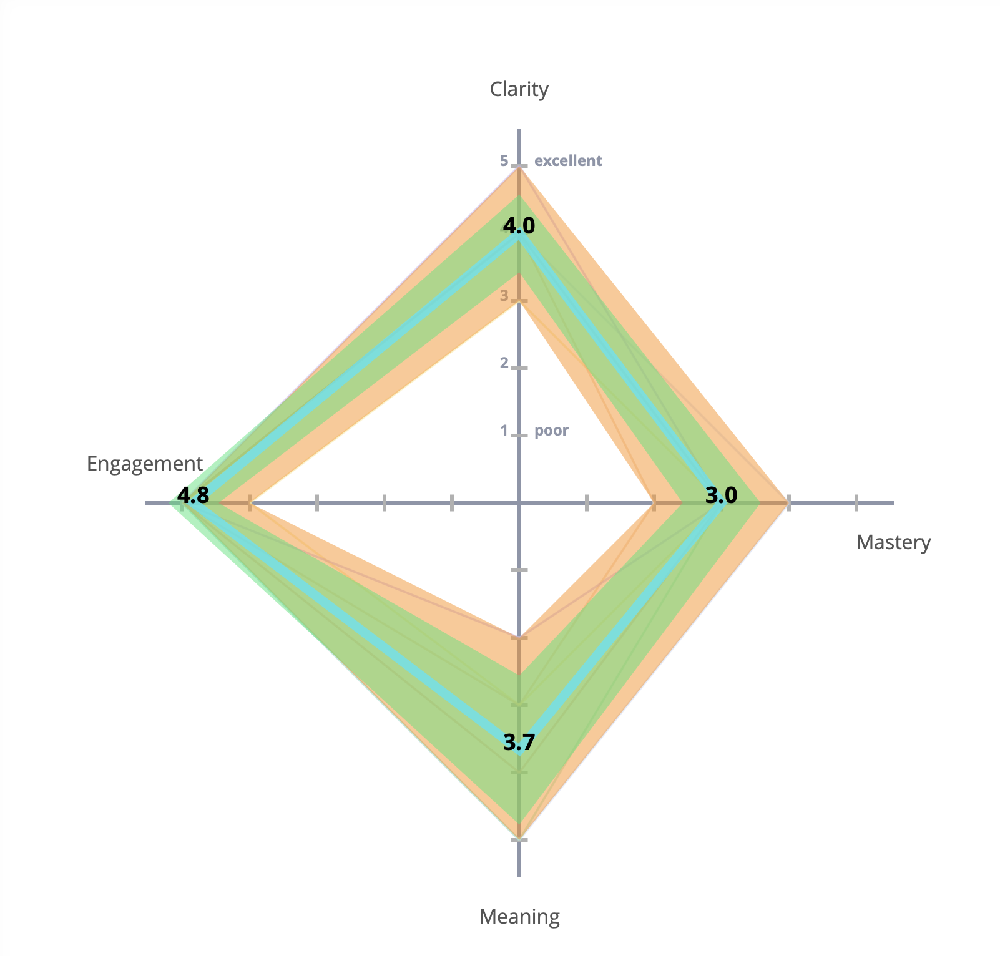
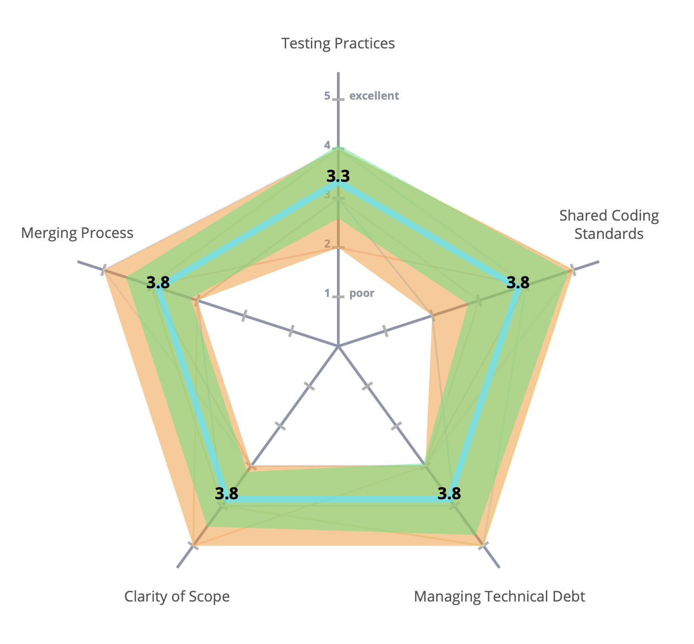
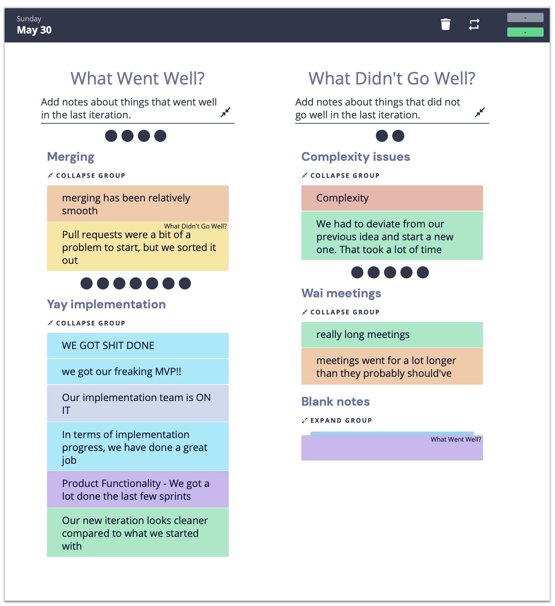
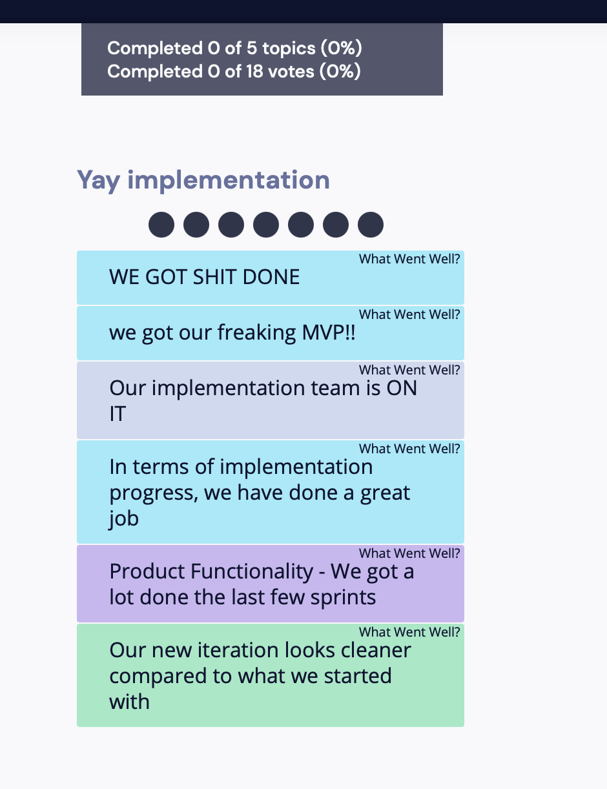
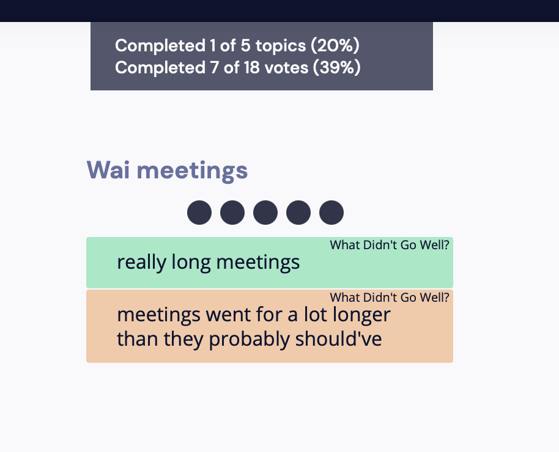

# 5/30 Retrospective Meeting

### Highlights
- We have made some progress in terms of implementation in this application
- Merging went relatively smooth
- Our new version looks better

### Challenges
- There are some techniqual gaps among the team members
- Some tasks are complex to deal with 
- Some meetings are very long

### Actions (Should do in the Future)
- Add more merging notes
- We should keep in mind the expected meeting time and availbility of others
- Arrange more small meetins within different individial task groups

### Retrium Content

#### First stage:

- Clarity: Whehter each one's task is clear 
- Mastery: How confident each one is about their individual task
- Meaning: How much does each team member think their tasks matter
- Engagement: Communication level among team members

#### Second stage:

- Testing Practice: For testing codes, We need to formalize or make the tesing more procedural
- Shared Coding standards: Whether our or others' codes follow the standards
- Managing Technical Debt: Some problems we may be lazy to solve at this time but may cause problems in the future
- Clarity of Scope: The coding structure within the files or classes
- Merging Process: The overall merging process experience 

#### Third stage:

