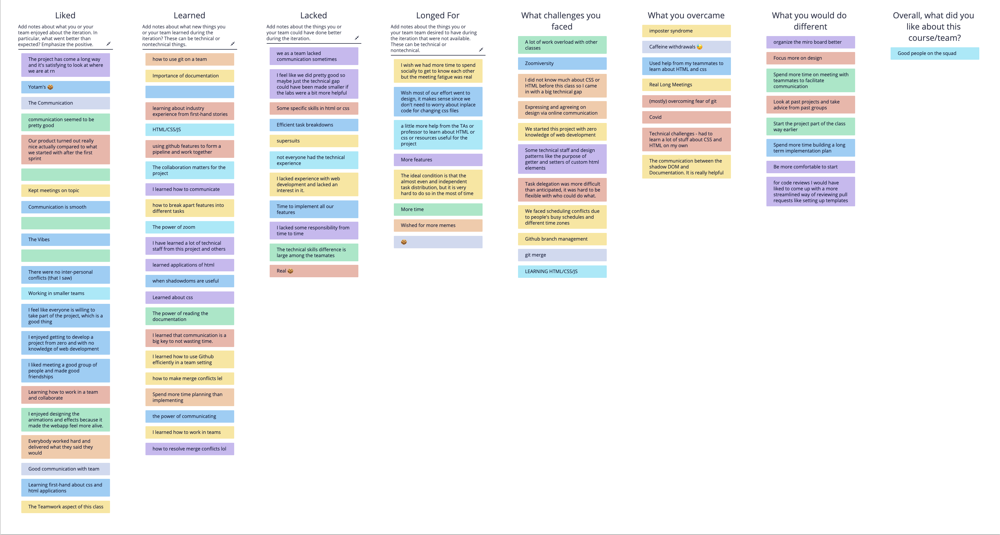

# 5/30 Retrospective Meeting for the whole quarter

### Highlights
- We have succefully implemented the bullet journal application. We are happy
- The communication among teamates are really smooth and efficinent
- Ther were no inter-personal conflicts
- Most of us had zero web development knowleadge and we are glad to see where we are now
- Most of us feel happy after seeing their work makes the application become better and better
- The teamwork is very healthy 

### Challenges
- There are huge techniqual gaps among the teamates and it took some time for some of us to catch up the progress
- All our meetings are online which lacks the personal interaction
- People have busy schedule in the quarter so it is hard to find a time to work together
- There are lots of branch conflits in github managements
- It is hard to learn css/html/javascript from the scratch cuccrently with other course

### Actions (Should do in the Future)
- Make more use out of miro board
- Focus more and dedicate more time to the design part of the application, instead of just functionaliy
- Spend more time on meeting with teammates to facilitate the communication
- Start earlier on the implementation of the project
- Set up a more clear workflow for code review like documention, functionality, design.

### Retrium Content

#### Overall Feedback:

