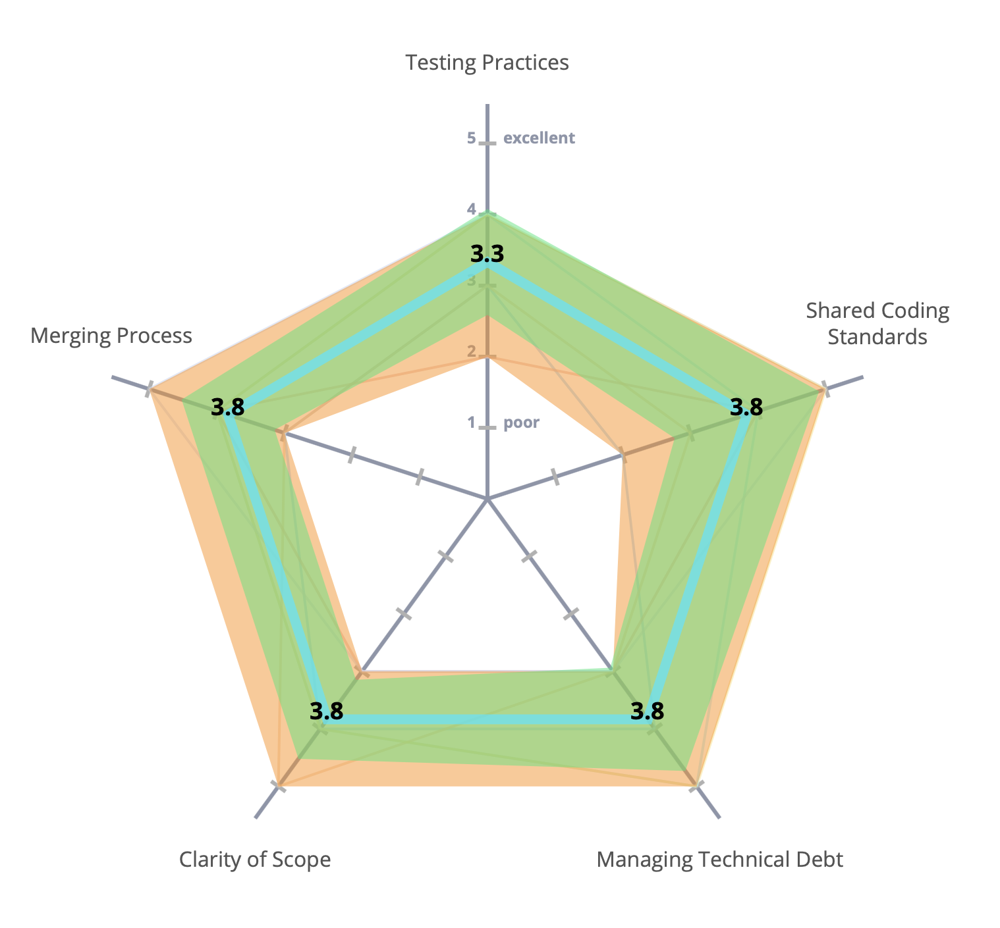
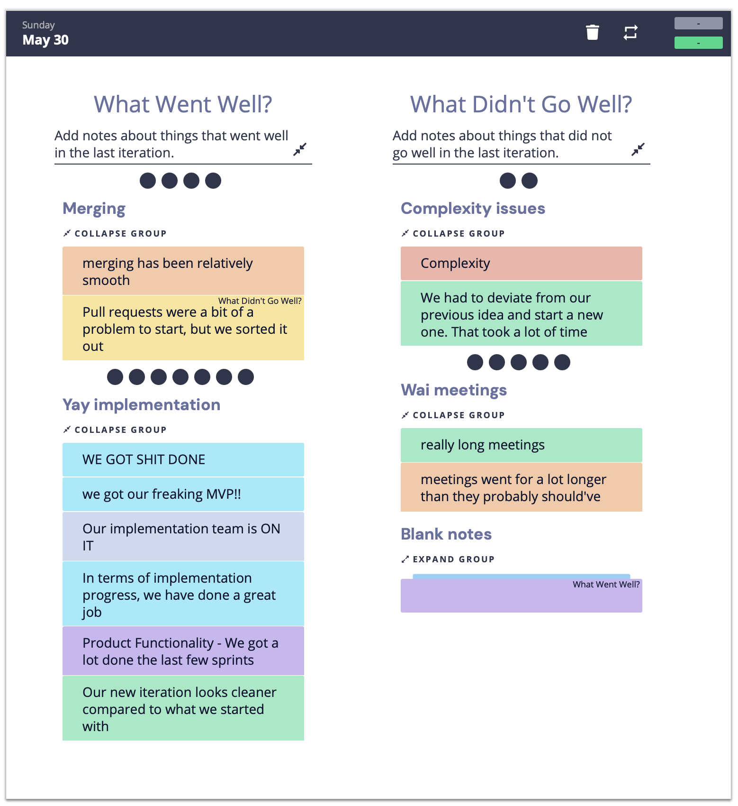
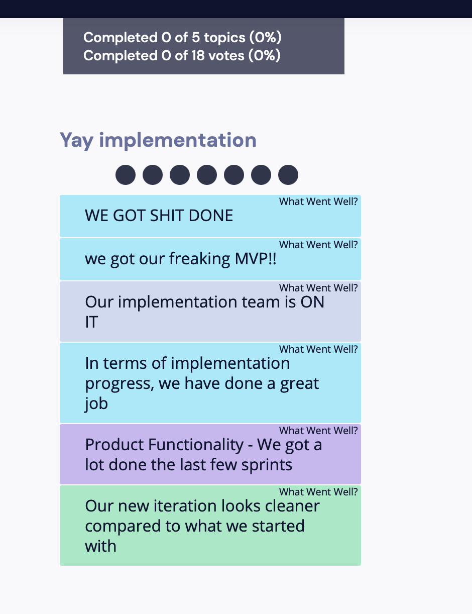
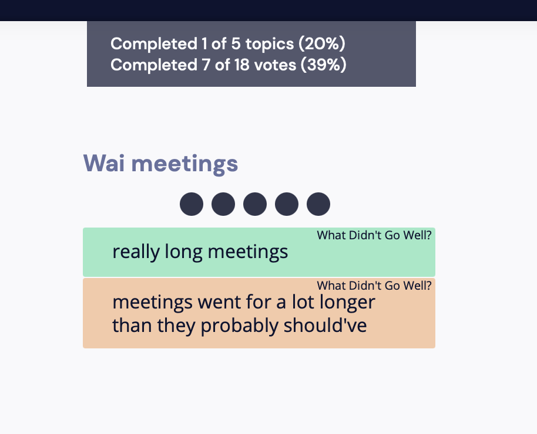

# 5/30 Retrospective Meeting for the whole quarter

### Highlights

### Challenges

### Actions (Should do in the Future)

### Retrium Content

#### First stage:

- Clarity: Whehter each one's task is clear 
- Mastery: How confident each one is about their individual task
- Meaning: How much does each team member think their tasks matter
- Engagement: Communication level among team members

#### Second stage:

- Testing Practice: For testing codes, We need to formalize or make the tesing more procedural
- Shared Coding standards: Whether our or others' codes follow the standards
- Managing Technical Debt: Some problems we may be lazy to solve at this time but may cause problems in the future
- Clarity of Scope: The coding structure within the files or classes
- Merging Process: The overall merging process experience 

#### Third stage:

