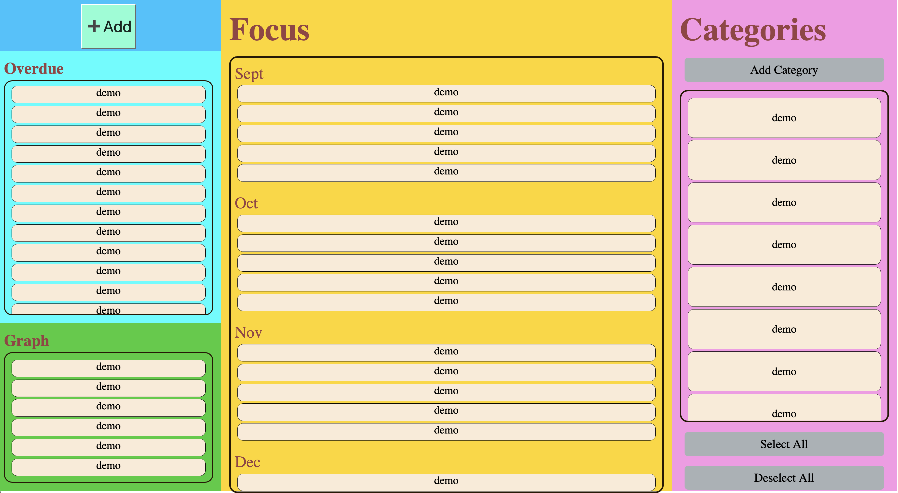

# Storage Team: Rudy Tony

What's Done:
- Proof of concept for user auth login page
- Used Supabase database/serverside scripting wrapper to simplify our implementation for now, I assume since its not taught in the scope of our class, the prof would not shit on us too hard for not wanting to implement it from scratch. Deepak says we can use whatever for backend.

What will be worked on:
- Research into websockets(?) might not be necessary for our CRUD app.
- Set up demo component for our Tasks to further test storing and updating user data from database.

Other notes:
- I will message the professor to see if my explanation is justified for our implementation
- Check it out! https://test.pageus.site

---
# CICD Team: Ryan, Sanjai, and Andres
*Submit by 10pm Monday Night*

What's Done:
- Established preliminary CI/CD pipeline. It includes these jobs: build, test, styling.
- Linked our repo with Codacy. A tool suggested by the professor for code quality
- Pushed the necessary requirements for tonight's CI/CD pipeline checkpoint (05/17)

What will be worked on:
- Implement Unit tests
- Implement Documentation Generation
- Modify our linting tool to only specify styling errors about HTML, CSS, and Javascript files

Other notes:
Current pipeline diagram:

---
# Editor Team: Yotam, Richard

What's Done:
- Cleaned up and commented existing code for editor layouts
- Added event listeners to submit and reset buttons

What will be worked on:
- combining main page with editor pages to have it all on one page
- Getting submitted journal entry to show up on main page
- Add github issues for above tasks

Other notes:
Will have a meeting with the two groups working on this on Tuesday at 8pm to discuss implementation details

---

# Editor Team: Beilei, Aman

What’s Done:
- Linked MainPage and bullet editor

What will be worked on:
- Comment and style checking
- Link MainPage and category editor
- make the html custom element for bullet item and category item
- Make the connection between mainpage and editors (custom element information)

Other notes:
- Will meet with Yotam and Richard today to discuss more

---
### Current Apearance of application:

---
### Note:
All the contents were inclucded in the meeting folder and we decided to sepereate them from the folder to clear structure