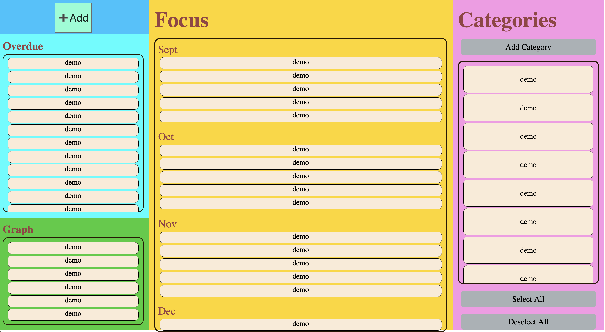

# Storage Team: Rudy Tony

What’s done:
- Added working localstorage
- Bullet/category checks will be stored/remembered as well
- Added ids for each category/bullet entry (including new ones) in format id=“bulletX” where X is an integer and id =“cateY” where Y is also an integer. Added the ids to help keep track of bullets/categories that are checked in localstorage. We can remove the ids if necessary though.

What will be worked on:
- Currently after a certain number of categories are added the category-entry id goes from “category 2”,“category3",category”4",category”41",category”411" which is a bug and will be fixed on. Bullet ids work fine though.

---
# CICD Team: Ryan, Sanjai, and Andres

What’s done:
- implemented linting for CSS, HMTL
- implemented linting for specific directory source
- finished writing basic unit tests
- deliverables for phase 2 check in

What will be worked on:
- Integrating unit tests into GitHub actions
- implement documentation generation

---
# set/filter implementation Team: Billy, Richard, Aman

What’s done:
- Category list showing up in new bullet editor
- Category filtering implemented

What will be worked on:
- Bullet editor does not correctly load category information
- Day filter implementation

---
### Current Apearance of application:

---
### Note:
All the contents were inclucded in the meeting folder and we decided to sepereate them from the folder to clear structure