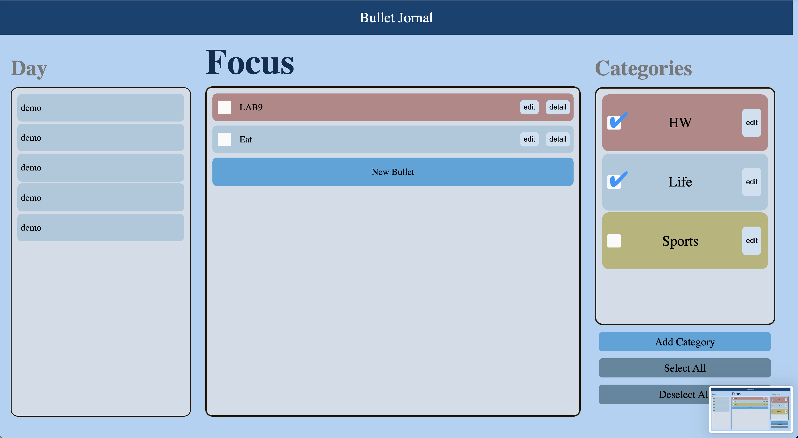

# Storage Team: Rudy Tony

What’s done:
- Sorting for both storage and live ui working on both dates and bullets in ascending order by date.
- When last task of a date is deleted it will also be deleted in the dates section.
- Deleted storage branch because it was an old version of overall implementation

What will be worked on:
- Haven’t tested every case with the new sorting implementation so there might be some edge cases.

Note: Pulled from date-selector branch then added the sorting implementations mentioned above to it and pushed the new implementation (that has the sorting implementation added) onto storage_sort

---
# CICD Team: Ryan, Sanjai, and Andres

What’s done:
- implemented linting for CSS, HMTL
- implemented linting for specific directory source
- finished writing basic unit tests
- deliverables for phase 2 check in
- Integrating unit tests into GitHub actions
- implement documentation generation 
- branch reviews
- What will be worked on:
- rewriting unit tests to test functions as well
- helping the UI/UX team

---
# Feature Team: Billy, Richard, Aman

What’s Done:
- Journal typo corrected
- Select all / deselect all buttons functional
- note/event/task now have different symbols.
- Default category implemented. Discrete category item in the box. can not be deleted once created (pending)
- Delete function completed (both on bullet and category, ugly button added). Delete on category will auto assign bullets of deleted bullets to default category
- Detail will be hidden once uncheck its category. rudy implemented it 
- Day filter is a soft filter meaning if no day is selected, auto select all days. Category is a hard filter. if no category selected, no bullets will show up. (user can quickly select and deselect all category)

Other notes:
- All features are synched with storage except:
    - taks completion information is not stored. when refresh, every completed task become uncompeleted
- Need to improve user experience like appearance and inline editor.

---
# Documentation Team: Yotam

What's done:
- Finished adding documentation for all of the js files in sources folder
- Cleaned up some extra blank space in files

Other notes:
- Got some linting issues when I pushed the code, not sure how to take care of this (@Andres maybe you could help guide me on what I need to fix)
- You guys should check my comments to make sure that they cover everything

---
### Current Apearance of application:

---
### Note:
All the contents were inclucded in the meeting folder and we decided to sepereate them from the folder to clear structure
