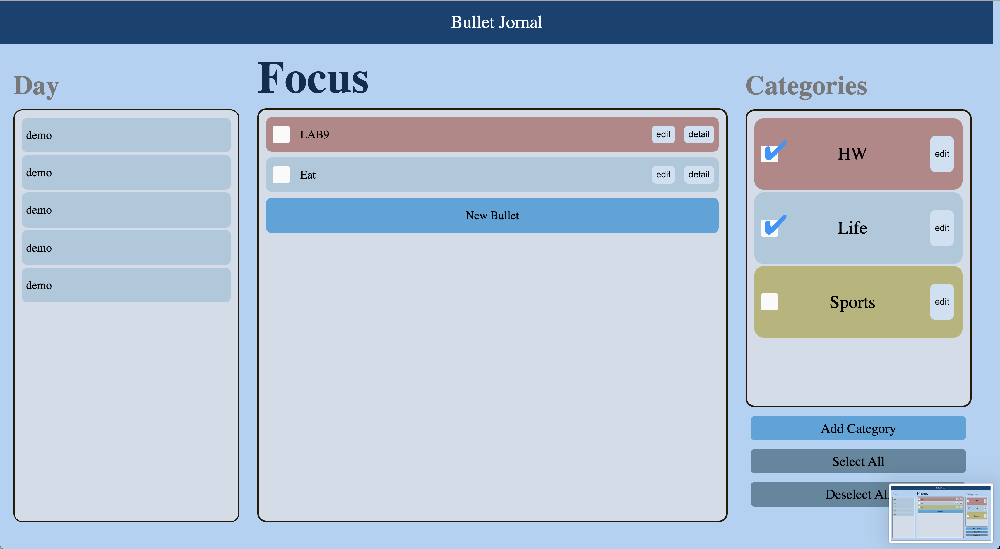

# Storage/Implementation Team: Rudy Tony Billy, Aman

What’s done:
- Reimplemented memory of checked tasks/categories in storage.
- Added unique IDs for each category entry and bullet entry using Date.now(). Added unique IDs because it will help us update the checks in storage for both categories and tasks.
- What will be worked on:
- Currently there’s a bug where if you have a category unchecked (the tasks with that category should not be displayed) then the current bullets with those categories will not be displayed as should be but if we add a new bullet with that category then it will be displayed.
- Fixed bug mentioned in this update: https://cse110-sp21-group32.slack.com/archives/C01UD6CPQHZ/p1622498366001000
- Fixed a bug where bullet’s weren’t updating correctly after the first edit you make on a bullet

What will be worked on:
- Will run through some test cases to see if we missed anything.
- Will help out with making UI look prettier

Note: Pushed these new implementations to storage_sort branch

---
# UX Team: Richard

What's done:
- Finished the "greyed" out for completed tasks and pushed into a new branch called "completed fade"

What will be worked on:
- continue working on button to change views from original page to only focus (if wanted seems still undecided)
- other smaller things to make UI overall better

---
# CICD Team: Ryan, Sanjai, and Andres

What's done:
- Published our webapp for E2E testing
- Code clean-up for linting + deadcode

What's being worked on:
- Rebasing/Merging Date-Selector

Notes:
We are still in the process of conflict resolution so @channel don't make any commits to date-selector or main

EDIT:
conflict resolution has been completed and main is ready to be used again

---
# Documentation Team: Yotam

What's done:
- Finished adding documentation for all of the updated js files in sources folder

---
### Current Apearance of application:

---
### Note:
All the contents were inclucded in the meeting folder and we decided to sepereate them from the folder to clear structure
