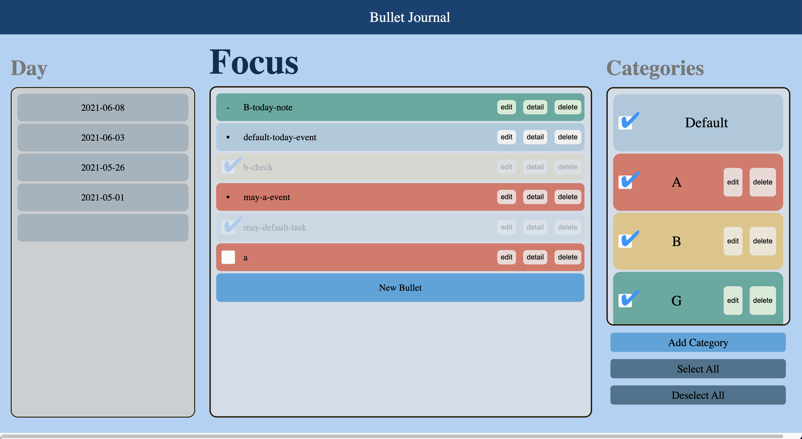

# Storage/Implementation Team: Rudy Tony Billy, Aman

What’s done:
- When no day is selected, the day select box will gray out to make the soft filter concept more clear
- More colors added for categories
- Animations feature merged especially hovering
- Completion effect of tasks merged

What will be worked on:
- Will run through some test cases to see if we missed anything.
- Will help out with making UI look prettier

Note: Pushed these new implementations to storage_sort branch

---
# UX Team: Richard, Yotam

What's done:
- Added new colors and removed some of the old possible colors for the categories
- Updated js files to reflect the new color changes in the bullet entries
- Icons have been added (not merged)
- Different Views button has been added (with hover)

Notes:
- Published to new branch: icy-colors
- Please look over the new colors and their names and lmk what you guys thin

---
# CICD Team: Ryan, Sanjai, and Andres

What’s done:
- pipeline is complete
- E2E testing completed 6/12 tests

What’s left:
- unit testing

---
# Documentation Team: Yotam

What's done:
- Finished adding documentation for all of the updated js files in sources folder

---
### Current Apearance of application:

---
### Note:
All the contents were inclucded in the meeting folder and we decided to sepereate them from the folder to clear structure
