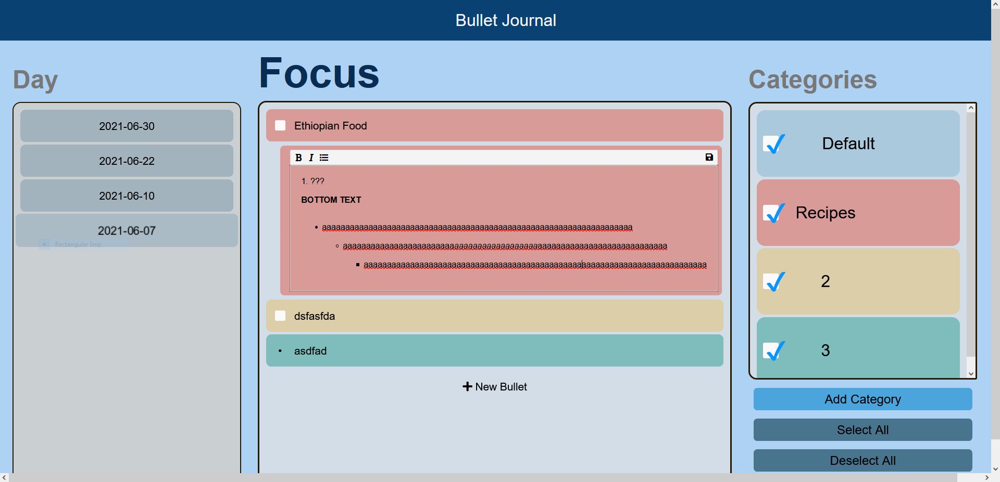

# Storage/Implementation Team
What’s done:
- inline edit for bullet and category
- basic rich text editor in bullet description
- inline add bullet/category
- general design improvements

Note: Pushed these new implementations to storage_sort branch

---

# CICD Team: Ryan, Sanjai, and Andres

Will do:
- Update unit/e2e testing to match the new version

---
# Documentation Team: Yotam

What's done:
- Finished adding documentation for all of the updated js files in sources folder

---
### Current Apearance of application:

---
### Note:
All the contents were inclucded in the meeting folder and we decided to sepereate them from the folder to clear structure
