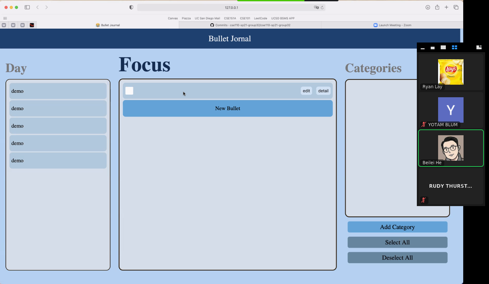

# Decision on the position of the new bullet

* Status: [accepted]
* Deciders: Design members
* Date: [2021-05-23]

## Context and Problem Statement

Originally, we have the add new bullet button on the top right cornor of the screen, but it is unintuitive to locate the button outside of the focuc button. 

## Decision Drivers 

* Whether it is intuitive for the user to use

## Considered Options

* New add button outside of focus window
* New add button at the buttom of the entries

## Decision Outcome

We have agreed that the new bullet button should be at the bottom of the entires.