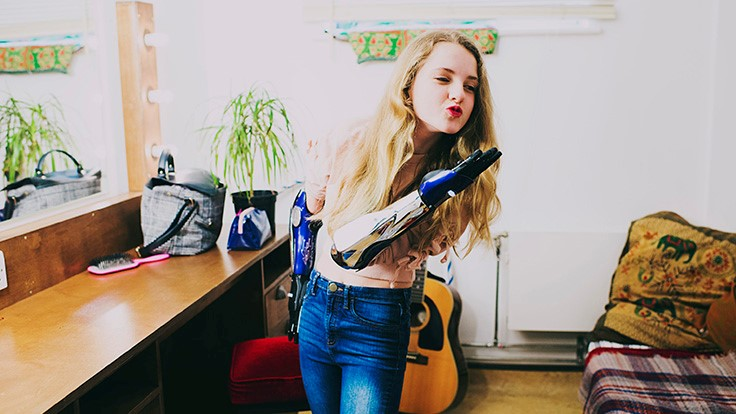

<<<<<<< HEAD

Name: Lilith Silver
Age: 20
Undergraduate, Non-STEM student

Profile: Sophomore undergraduate Music Theory student. Likes playing guitar and bowling in free time. Left handed. Has a prosthetic right arm from a car accident. Namesdottir has been feeling too much pressure for time management. She really wants some way to optimize her time so that she can enjoy doing the things she loves, namely bowling and guitar playing.

Hobbies: 
- Playing guitar
- Bowling
- Learning about Machine Learning

Goals/Aspirations:
- Combine machine learning and music to be the next John Williams
- Score a perfect 300 bowling game at least once
- Get enough money to get a multitool in her prosthetic

Frustrations:
- People assuming that she's into classical music
- Not being able to paint her prosthetic to look like a cyborg arm because she has no talent with colors

Favorite Genres of Music
1. Pop
2. Smooth Jazz
3. Punk Rock
=======

Name: Lilith Silver
Age: 20
Undergraduate, Non-STEM student

Profile: Sophomore undergraduate Music Theory student. Likes playing guitar and bowling in free time. Left handed. Has a prosthetic right arm from a car accident. Namesdottir has been feeling too much pressure for time management. She really wants some way to optimize her time so that she can enjoy doing the things she loves, namely bowling and guitar playing.

Hobbies: 
- Playing guitar
- Bowling
- Learning about Machine Learning

Goals/Aspirations:
- Combine machine learning and music to be the next John Williams
- Score a perfect 300 bowling game at least once
- Get enough money to get a multitool in her prosthetic

Frustrations:
- People assuming that she's into classical music
- Not being able to paint her prosthetic to look like a cyborg arm because she has no talent with colors

Favorite Genres of Music
1. Pop
2. Smooth Jazz
3. Punk Rock
>>>>>>> styling-improve
4. Norweigan Death Metal